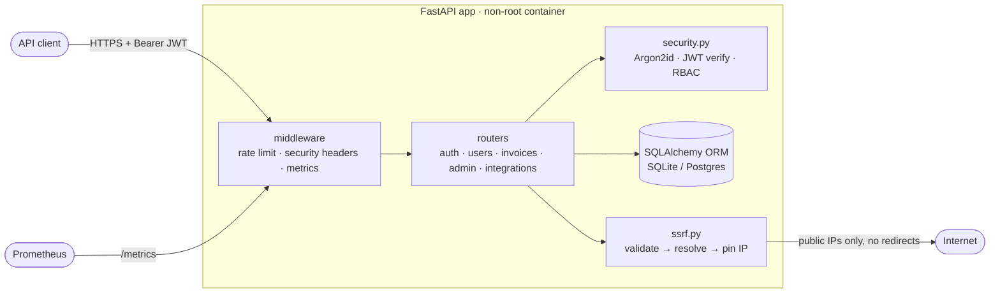
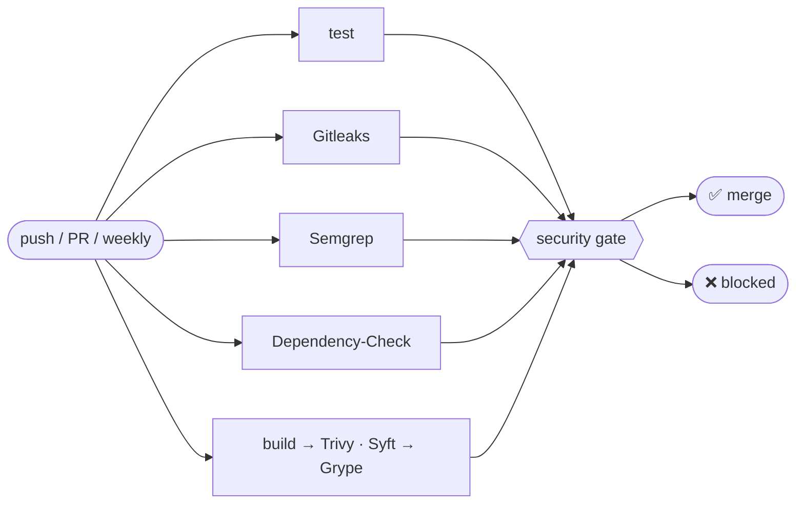

# Secure Invoice API: FastAPI + DevSecOps pipeline

A small multi-tenant invoicing API built to be **secure by design against the
OWASP Top 10 and OWASP API Security Top 10**, plus a GitHub Actions pipeline
that proves it on every commit: SAST, SCA, container and IaC scanning, SBOM
generation, secret scanning and a policy-driven severity gate that fails the
build.

> Project 1 of a DevSecOps portfolio. The same API is deployed and hardened on
> Kubernetes (Project 2), monitored for attacks with Prometheus and Grafana
> (Project 3), threat-modelled with STRIDE and fed into DefectDojo (Project 4),
> and the pipeline is ported to GitLab CI (Project 5).

---

## What's in here

| Area | What it demonstrates | Where |
|---|---|---|
| Secure API | BOLA/IDOR protection, JWT hardening, Argon2id, mass-assignment protection, parameterised queries, SSRF guard with IP pinning, rate limiting, secret handling, security headers | [`app/`](app/) |
| Security regression tests | 100+ tests that exercise attack patterns against each control | [`tests/`](tests/) |
| Custom SAST rules | 8 Semgrep rules encoding this codebase's security decisions, unit-tested | [`semgrep-rules/`](semgrep-rules/) |
| CI pipeline | Gitleaks, Semgrep, OWASP Dependency-Check, Trivy (image/config/fs), Syft SBOM, Grype | [`.github/workflows/devsecops.yml`](.github/workflows/devsecops.yml) |
| Severity gate | Normalises every scanner, blocks on HIGH/CRITICAL, fails closed, time-boxed exceptions | [`scripts/security_gate.py`](scripts/security_gate.py), [`security-gate.toml`](security-gate.toml) |
| Vulnerability reports | One report per weakness class: OWASP, CWE, CVSS, control, verification, residual risk | [`docs/controls/`](docs/controls/) |
| Scan results | Latest local pipeline run | [`docs/scan-results.md`](docs/scan-results.md) |

## Architecture



### Endpoints

| Method | Path | Auth | Notes |
|---|---|---|---|
| POST | `/auth/register` | none | rate-limited; role is always `user` |
| POST | `/auth/login` | none | rate-limited per IP+account and per account; 15-min JWT |
| GET/PATCH | `/users/me` | user | PATCH accepts `full_name` only |
| GET/POST | `/invoices` | user | owner-scoped, paginated (≤100) |
| GET | `/invoices/search?q=` | user | owner-scoped, parameterised, wildcards escaped |
| GET/PATCH/DELETE | `/invoices/{id}` | owner | foreign IDs → 404 |
| GET | `/admin/users` | admin | router-level role check |
| PATCH | `/admin/users/{id}/role` | admin | audit-logged |
| POST | `/integrations/url-preview` | user | SSRF-guarded outbound fetch |
| GET | `/healthz`, `/metrics` | none | metrics restricted by NetworkPolicy in K8s |

## Security controls

| ID | Weakness designed against | OWASP | CWE | Report |
|---|---|---|---|---|
| SIA-01 | BOLA / IDOR | API1:2023 | CWE-639 | [report](docs/controls/API1-bola.md) |
| SIA-02 | Broken authentication (weak JWT) | API2:2023 · A07 | CWE-347 | [report](docs/controls/API2-broken-authentication.md) |
| SIA-03 | SQL injection | A03 | CWE-89 | [report](docs/controls/A03-sql-injection.md) |
| SIA-04 | Mass assignment | API3:2023 | CWE-915 | [report](docs/controls/API3-mass-assignment.md) |
| SIA-05 | SSRF | API7:2023 · A10 | CWE-918 | [report](docs/controls/A10-ssrf.md) |
| SIA-06 | Missing rate limiting | API4:2023 | CWE-307, CWE-770 | [report](docs/controls/API4-rate-limiting.md) |
| SIA-07 | Hard-coded secrets | A07 · A02 | CWE-798 | [report](docs/controls/A07-hardcoded-secrets.md) |
| SIA-08 | Broken function-level authorization | API5:2023 | CWE-285 | [report](docs/controls/API5-function-level-authz.md) |
| SIA-09 | Security misconfiguration | API8:2023 · A05 | CWE-16, CWE-209, CWE-250 | [report](docs/controls/A05-misconfiguration.md) |

Each control is verified twice: by regression tests on every commit, and by a
scanner or custom Semgrep rule that catches reintroduction of the pattern. See
the [coverage matrix](docs/controls/README.md#where-each-class-is-caught).

## Pipeline



Full write-up (design decisions, supply-chain hardening, branch protection):
**[docs/pipeline.md](docs/pipeline.md)**.

---

## Quick start

### Run the API (Docker)

```bash
cp .env.example .env
python -c "import secrets; print('APP_SECRET_KEY=' + secrets.token_urlsafe(48))" >> .env
docker compose up --build
# http://127.0.0.1:8000/docs  (APP_DOCS_ENABLED=true in .env.example)
```

Create an admin (out-of-band only; there's no API path to become admin):

```bash
docker compose exec -e APP_ADMIN_PASSWORD='<12+ chars>' api python -m app.cli create-admin --email admin@example.com
```

### Try it

```bash
curl -s -X POST localhost:8000/auth/register -H 'content-type: application/json' \
  -d '{"email":"alice@example.com","full_name":"Alice","password":"a-long-passphrase-1"}'
TOKEN=$(curl -s -X POST localhost:8000/auth/login -H 'content-type: application/json' \
  -d '{"email":"alice@example.com","password":"a-long-passphrase-1"}' | python -c "import sys,json;print(json.load(sys.stdin)['access_token'])")
curl -s -X POST localhost:8000/invoices -H "authorization: Bearer $TOKEN" -H 'content-type: application/json' \
  -d '{"customer_name":"ACME GmbH","amount_cents":125000}'
```

### Tests

```bash
docker build --target test -t secure-invoice-api:test . && docker run --rm secure-invoice-api:test pytest --cov
```

Or natively (Python 3.12+):

```bash
python -m venv .venv && . .venv/bin/activate   # Windows: .venv\Scripts\activate
pip install --require-hashes -r requirements.txt -r requirements-dev.txt
pytest --cov && ruff check . && ruff format --check .
```

### Run the whole security pipeline locally

Only Docker is needed. The script uses the same pinned scanner images as CI:

```bash
bash scripts/scan-local.sh                  # all scanners except Dependency-Check
NVD_API_KEY=... bash scripts/scan-local.sh --with-depcheck
```

Reports land in `reports/`, and the gate's verdict is printed at the end.

### Enable it on GitHub

1. Push to a new GitHub repository.
2. **Settings → Secrets → Actions**: add `NVD_API_KEY` (free,
   [request here](https://nvd.nist.gov/developers/request-an-api-key)).
3. **Settings → Branches**: protect `main` and require the **Security gate** and
   **Lint + security regression tests** checks.
4. Replace `@YOUR_GITHUB_USERNAME` in `.github/CODEOWNERS`.
5. Optional: public repos get SARIF results in **Security → Code scanning**
   for free.

## Demonstrating red → green

The branch `demo/red-pipeline` contains one realistic commit that a developer
might make: it adds a YAML config dependency pinned to an old version with
known CVEs, and "temporarily" drops the non-root `USER` from the Dockerfile to
debug a permissions issue. The gate blocks it on:

- **SCA**: Trivy, Grype and Dependency-Check each flag the vulnerable PyYAML
  pin, which is fixable, so the gate blocks it (reported once after
  deduplication);
- **IaC**: Trivy config flags the root container (`AVD-DS-0002`, HIGH).

The follow-up commit on the same branch upgrades the dependency and restores
`USER 10001`, and the gate goes green. Open a PR from that branch to see both
states in the Actions tab. See [docs/scan-results.md](docs/scan-results.md) for
the local numbers.

## Repository layout

```
app/                 FastAPI application (factory: app.main:create_app)
  routers/           auth, users, invoices, admin, integrations
  security.py        Argon2id, JWT issue/verify, auth dependencies
  ssrf.py            outbound HTTP guard
  ratelimit.py       sliding-window limiter
  metrics.py         Prometheus metrics (security signals for Project 3)
tests/               security regression tests + gate tests + fixtures
semgrep-rules/       custom rules + their unit tests
scripts/
  security_gate.py   severity gate (stdlib only)
  scan-local.sh      run the pipeline locally with Docker
docs/
  controls/          per-weakness security reports
  pipeline.md        pipeline design
  scan-results.md    latest scan results
.github/             workflow, Dependabot, CODEOWNERS, PR template
security-gate.toml   gate policy
```

## Interview talking points

- **Why a separate gate?** Scanners disagree on severity names and exit codes.
  Normalising first and deciding once gives one auditable policy, complete
  results and fail-closed behaviour when a scanner crashes.
- **Why not block unfixed CVEs?** Developers can't act on them. Blocking
  teaches people to bypass the gate. They're tracked with SLAs in
  vulnerability management (Project 4), and the weekly scheduled scan catches
  the day a fix ships.
- **Why three SCA tools?** They use different data sources (NVD CPE matching
  vs GHSA/OSV package matching) and disagree in practice. Dedup in the gate
  keeps the noise down.
- **SSRF:** validating the URL string is not enough. The guard validates the
  *resolved* IPs and then connects to the validated IP, which also closes DNS
  rebinding.
- **BOLA:** the owner filter lives in the SQL `WHERE` clause, not in an `if`
  after the fetch, and foreign IDs return 404, not 403.

## License

MIT
