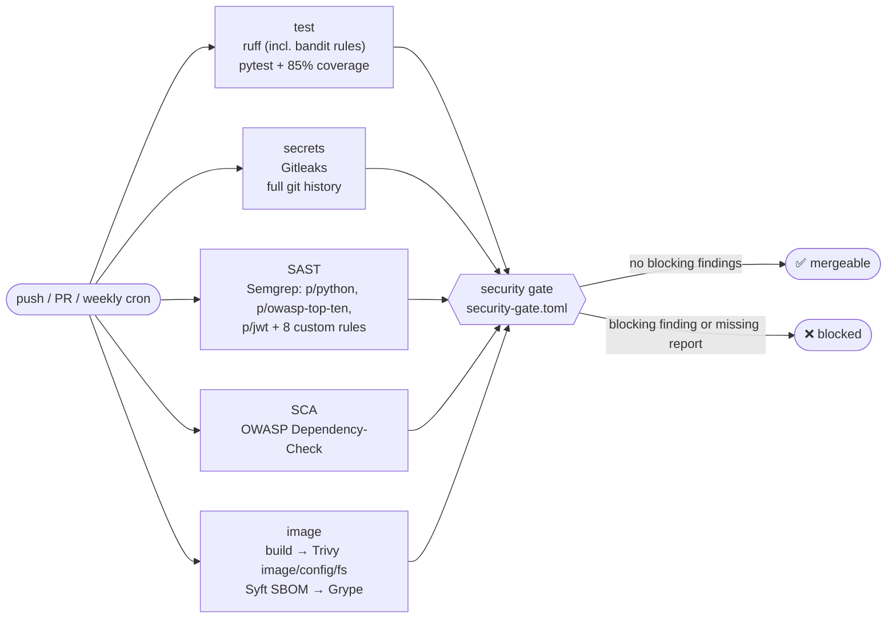

# DevSecOps pipeline

Workflow: [`.github/workflows/project1-devsecops.yml`](../../.github/workflows/project1-devsecops.yml)
· Gate policy: [`security-gate.toml`](../security-gate.toml)
· Gate engine: [`scripts/security_gate.py`](../scripts/security_gate.py)
· Local equivalent: [`scripts/scan-local.sh`](../scripts/scan-local.sh)



## Stages

| Job | Tool (pinned) | Scans | Report(s) | Why this tool |
|---|---|---|---|---|
| `test` | ruff 0.16, pytest 9 | lint incl. flake8-bandit `S` rules; 115 tests (security regression, gate, image policy, Dependency-Check coverage); coverage ≥85% | JUnit, coverage XML | Fastest feedback; regression tests prove the controls, scanners only find patterns |
| `secrets` | Gitleaks 8.30.1 (binary, SHA-256 verified) | every commit in history | `gitleaks.json` | A secret deleted in a later commit is still leaked; only history scans find it |
| `sast` | Semgrep 1.177.0 | Python source | `semgrep.json`, SARIF → Code Scanning | Community rules + project rules that encode *this* codebase's decisions ([semgrep-rules/](../semgrep-rules/)); rules are unit-tested (`semgrep --test`) |
| `dependency-check` | OWASP Dependency-Check 13.0.0 | pins extracted from `requirements*.txt` (NVD CPE matching); **coverage-verified**: the job fails unless every pin was analysed | JSON, SARIF, HTML | The SCA tool most job descriptions name; NVD-based, so it complements GHSA/OSV-based Trivy and Grype |
| `image` | Trivy 0.74.0 | built image (OS + Python packages + secrets in layers); Dockerfile and compose misconfiguration; lockfile | `trivy-image.json`, `trivy-config.json`, `trivy-fs.json`, SARIF | One tool for container CVEs and IaC misconfiguration; reused for K8s manifests in Project 2 |
| `image` | Syft 1.52.0 + Grype 0.119.0 | SBOM of the exact image that would ship | `sbom.cdx.json` (CycloneDX), `sbom.spdx.json` (SPDX), `grype.json` | SBOMs are a supply-chain deliverable in their own right (EU CRA, US EO 14028); Grype re-scans the SBOM, so a stored SBOM can be re-checked later without rebuilding |
| `security-gate` | `security_gate.py` (stdlib only) | all of the above | step summary, `gate-result.json` | See below |

## Why a separate gate job

Each scanner has its own exit-code semantics and severity vocabulary (Semgrep
`ERROR`, Grype `Negligible`, Dependency-Check CVSS scores). Letting each job
fail itself gives inconsistent thresholds, and the first failure hides the
others. Instead:

1. **Scanners always exit 0 and produce reports.** Every run shows the
   complete picture.
2. **The gate normalises everything** into one finding model and one severity
   scale (`CRITICAL…INFO`).
3. **One policy file** ([security-gate.toml](../security-gate.toml)) decides:
   - block on `CRITICAL` and `HIGH`;
   - dependency and image CVEs **without an available fix** are reported but
     don't block (developers can't act on them; they go to vulnerability
     management, Project 4). SAST, secret and misconfiguration findings always
     block;
   - **any secret is CRITICAL** regardless of rule;
   - the same CVE on the same package reported by several scanners blocks
     once (deduplication);
   - **time-boxed exceptions** need an approver and an expiry date. Expired
     exceptions stop applying automatically and are listed in the summary.
4. **Fail closed**: a required report that is missing or unparsable blocks the
   build. A crashed or skipped scanner can't produce a false green.
5. **Scanners must prove they scanned.** An empty SBOM fails the image job,
   and Dependency-Check must resolve every pinned package. Both gaps were
   found while building this pipeline: each tool exited 0 with no useful
   output.
6. The gate is itself tested (`tests/test_security_gate.py`): clean vs dirty
   fixtures, deduplication, fail-closed behaviour, exception expiry.

## Monorepo scoping without deadlocking required checks

The repository holds five projects. A trigger-level `paths:` filter looks
like the obvious way to run this workflow only for Project 1 changes, but a
filtered-out workflow **never reports a status**. With `P1 / Security gate` as a
required check, any PR that touches only another project (or a PR whose net
diff is empty) would wait forever. This was found when the fix commit of the
demo PR produced no run at all.

Instead, a small `changes` job diffs the PR (or push) and outputs
`project1=true|false`. Scanner jobs run only when it's `true`; the
`P1 / Security gate` job **always** runs and reports success with a "not affected"
summary when Project 1 is untouched. Scheduled and manual runs always scan
everything.

## Supply-chain hardening of the pipeline itself

- All third-party actions are **pinned to full commit SHAs** (tag in a
  comment); Dependabot bumps them.
- Scanner container images are pinned to exact versions; the Gitleaks binary is
  checksum-verified.
- `permissions: contents: read` at workflow level; only the SARIF-uploading
  jobs get `security-events: write`. `persist-credentials: false` on every
  checkout.
- Python dependencies are installed with `--require-hashes` everywhere (CI,
  Docker).
- `CODEOWNERS` makes the workflow, gate policy and scanner configs
  security-reviewed paths.

## Governance: making the gate binding

Branch protection on `main`, kept as code in [`.github/branch-protection.json`](../../.github/branch-protection.json) (15368 is the GitHub Actions app ID):

| Setting | Value | Why |
|---|---|---|
| Require a pull request | yes, 0 approvals | Nothing reaches `main` without going through the pipeline. Approvals are 0 because this is a single-maintainer repo (GitHub doesn't let you approve your own PR); a team would require 1+ and CODEOWNERS review |
| Required status checks | `P1 / Security gate`, `P1 / Lint + security regression tests`, both from the GitHub Actions app only | Pinning the source app stops another integration from posting a fake passing check with the same name |
| Include administrators | yes | "Don't allow bypassing": the repository owner is gated too |
| Force pushes / deletion of `main` | blocked | History of what was scanned stays intact |
| Linear history, conversation resolution | required | Readable history; review comments must be addressed |

Check names are prefixed per project (`P1 / …`) because required checks are
matched by name, and every project in the monorepo has its own gate.

Without branch protection the gate only advises; with it, a red gate blocks
the merge.

```bash
gh api -X PUT repos/<owner>/devsecops-portfolio/branches/main/protection --input .github/branch-protection.json
```

## Secrets used by the workflow

| Secret | Required | Purpose |
|---|---|---|
| `NVD_API_KEY` | Strongly recommended | Dependency-Check NVD download. Without it the first run is heavily rate-limited (can take >1h). Free: <https://nvd.nist.gov/developers/request-an-api-key> |

## Extending the pipeline (next steps)

- Sign the image and attach the SBOM as an attestation (cosign /
  `actions/attest-sbom`) once it's pushed to a registry.
- DAST: an OWASP ZAP API scan against the compose stack using the OpenAPI
  spec.
- Upload all reports to DefectDojo for triage and SLA tracking (Project 4).
